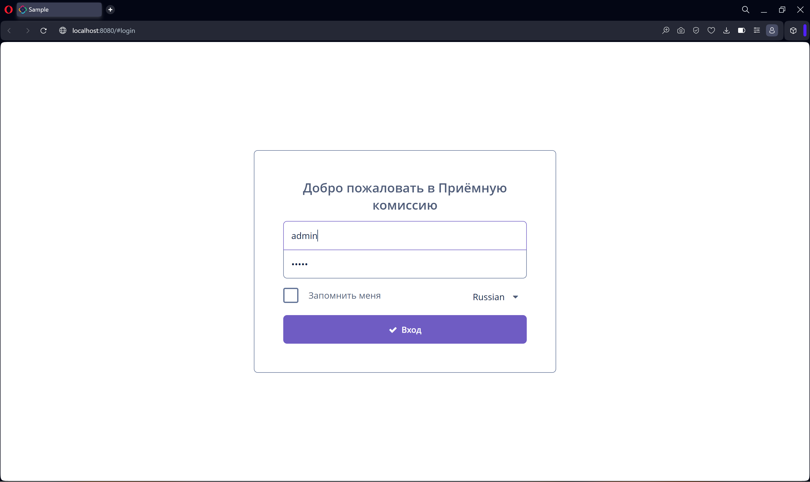
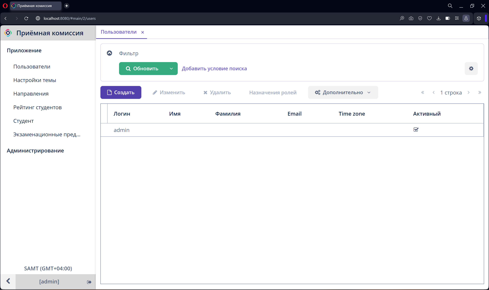
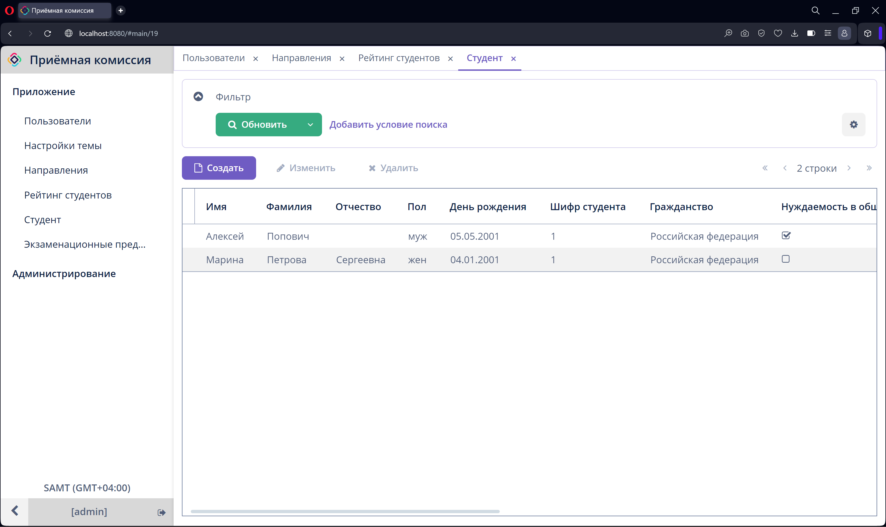
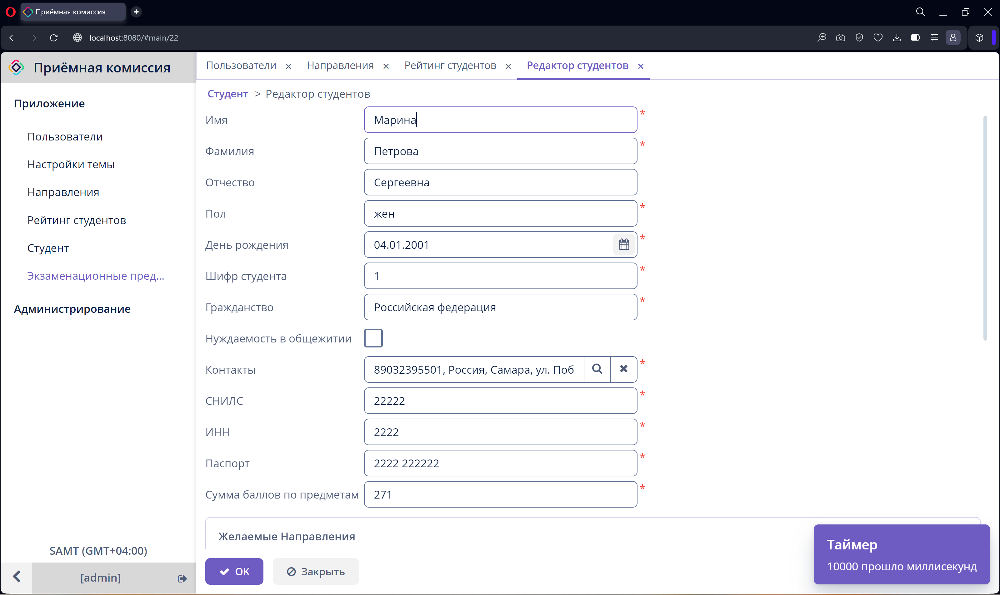
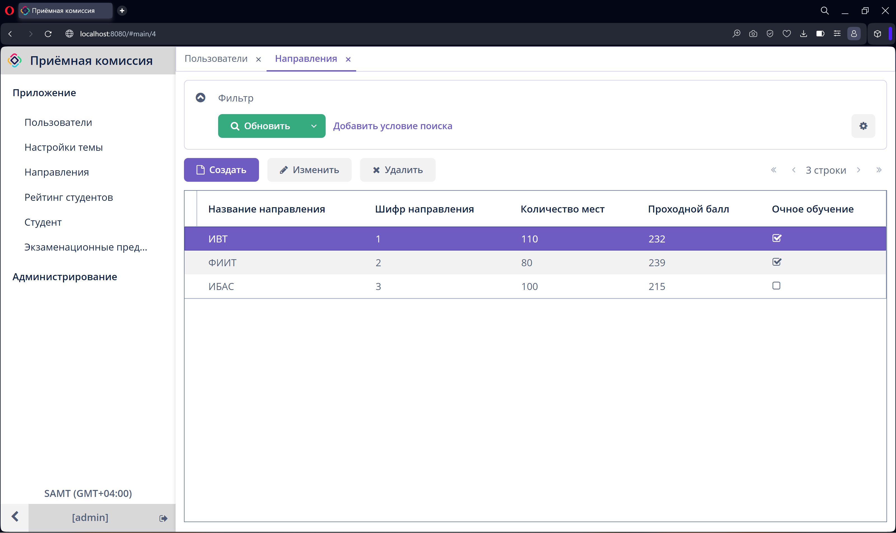
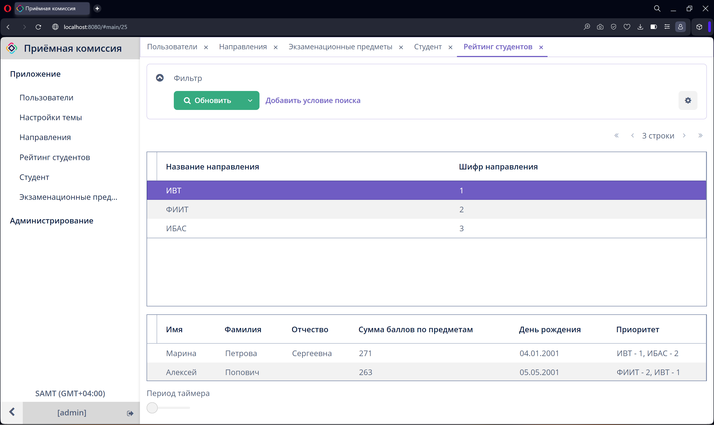
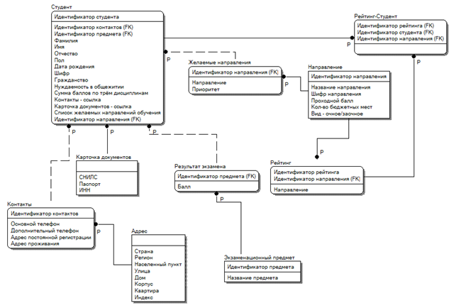

### Практическая работа по созданию информационной системы «Приемная комиссия».  

&nbsp;&nbsp;&nbsp;&nbsp;&nbsp;Основной платформой разработки был выбран Jmix, который сочетает в себе фреймворк SpringBoot, а также возможность для разработки UI на стороне сервера при помощи встроенных инструментов проектирования.

#### *Окно входа в систему*  

&nbsp;&nbsp;&nbsp;&nbsp;&nbsp; Окно входа является начальным экраном приложения и позволяет авторизоваться пользователям.

Окно входа в систему
  

#### *Список пользователей в системе*  

Окно со списком пользователей
  

#### *Список студентов, подавших документы*  

&nbsp;&nbsp;&nbsp;&nbsp;&nbsp;В данном списке можно добавлять, изменять и удалять информацию об абитуриентах.

Окно со спсиком студентов
  

#### *Форма для редактирования информации о студенте*  

&nbsp;&nbsp;&nbsp;&nbsp;&nbsp;При добавлении необходимо указать желаемые напрявления для поступления, которые необходимы для создания списка-конкурся по направлениям. 

Окно с формой для редактирования
  

#### *Список направлений, доступных для поступления*  

&nbsp;&nbsp;&nbsp;&nbsp;&nbsp;Данное окно позволяет добавлять, изменять и удалять университетские напрвления для поступления. 

Окно всо спсиком направлений
  

#### *Список абитуриентов по каждому направлению*  

&nbsp;&nbsp;&nbsp;&nbsp;&nbsp;Списки абитуриентов по направления обновляются автоматически, при этом пользователь может выставить период обновления вручную. 

Окно со списками абитуриентов
  

#### *Логическая модель базы данных*

